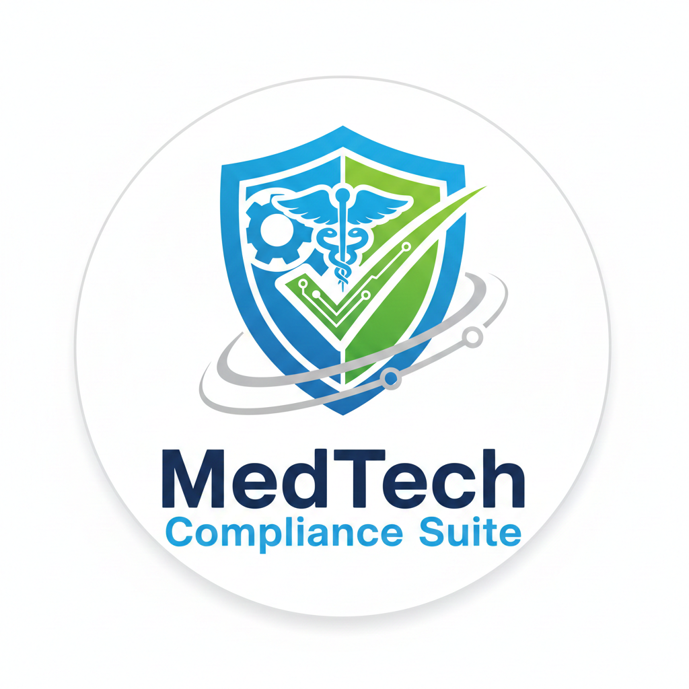

<div align="center">



# MedTech Compliance Suite™

### Enterprise Grade Quality Management System for Medical Device Manufacturers

[](LICENSE)
[](https://www.iso.org/standard/59752.html)
[](https://www.iso.org/standard/72704.html)
[](https://www.accessdata.fda.gov/scripts/cdrh/cfdocs/cfcfr/CFRSearch.cfm?CFRPart=820)
[](https://eur-lex.europa.eu/legal-content/EN/TXT/?uri=CELEX%3A32017R0745)
[](https://www.typescriptlang.org/)
[](https://reactjs.org/)
[](https://nodejs.org/)

[Features](#-key-features) • [Quick Start](#-quick-start) • [Download](#-download--install) • [Documentation](#-documentation) • [API Reference](#-api-reference) • [Contributing](#-contributing)

</div>

---

## Overview

**MedTech Compliance Suite** is a full stack, AI assisted Quality Management System built specifically for medical device manufacturers. It automates quality workflows, enforces data integrity, and provides real time regulatory compliance monitoring across the complete product lifecycle; from design control through post-market surveillance.

### Why MedTech Compliance Suite?

| Benefit | Detail |
|---------|--------|
| **Pre-configured regulatory frameworks** | ISO 13485, ISO 14971, FDA 21 CFR Part 820 & 11, EU MDR 2017/745 — ready on day one |
| **Full stack not just a UI** | React frontend + Express/SQLite backend with JWT auth, persistent audit trail, and REST API |
| **AI powered intelligence** | Local LLM agents (Ollama) for risk prediction, complaint analysis, and audit readiness queries |
| **21 CFR Part 11 compliant** | Electronic signatures, immutable audit logs, ALCOA+ data integrity |
| **Open source & self-hosted** | Full control over your data — no SaaS lock-in, no telemetry |
| **Automated compliance monitoring** | Real-time code analysis with hybrid AI (Ollama + watsonx.ai) |
| **Production ready security** | bcrypt passwords, rate limiting, CORS, Helmet, account lockout |

### Business Impact

| Metric | Improvement |
|--------|-------------|
| Audit preparation time | **80% reduction** |
| Quality process efficiency | **65% increase** |
| CAPA closure time | **45% faster** |
| Document retrieval time | **90% faster** |
| Risk identification accuracy | **95%+ with AI** |

---

## Key Features

### Core Quality Modules (19 Views)

| Module | Description |
|--------|-------------|
| **Dashboard** | Executive KPI overview with real-time alerts and trend charts |
| **Metrics Management** | 30+ ISO-mapped KPIs with automated threshold alerting |
| **Risk Matrix (ISO 14971)** | Interactive 5×5 severity/probability matrix with mitigation tracking |
| **CAPA Management** | Corrective & preventive action workflows with root cause analysis |
| **NCR Tracking** | Non-conformance reports with lot traceability and disposition |
| **Validation Reports** | EVT/DVT/PVT/DVP&R documentation with requirement traceability |
| **Change Control** | 21 CFR Part 11 change request workflows with impact assessment |
| **Lifecycle Management** | Design → Verification → Validation → Production → Post-Market |
| **Document Control (eDMS)** | Controlled documents with version history and approval workflows |
| **Supplier Management** | Supplier audits, certifications, scorecards, and SCAPA tracking |
| **Training & Competency** | Curriculum management, certification tracking, compliance matrix |
| **Vigilance / Complaints** | Post-market complaint tracking and adverse event reporting |
| **Field Safety Actions** | Recall management, safety notices, regulatory notifications |
| **Audit Trail** | Immutable, timestamped audit log with ISO clause references |
| **Analytics Dashboard** | Business intelligence with trend analysis and predictive metrics |
| **AI Agents** | Local LLM agents for vigilance monitoring, risk prediction, RAG queries |
| **Admin Panel** | User management, role-based permissions, security settings |
| **Settings** | Preferences, data import/export, theme, keyboard shortcuts |

### Backend API (Production-Ready)

- **REST API** — Full CRUD for all 14 compliance modules
- **JWT Authentication** — 128-char secret, 8-hour tokens, refresh tokens, account lockout
- **SQLite Database** — WAL mode, indexed, auto-migrated, integrity checks
- **Persistent Audit Trail** — SHA-256 hash chain, tamper detection, proxy-aware IP tracking
- **Data Export** — JSON and CSV for all modules and the audit trail
- **Health Monitoring** — `/api/health` and `/api/health/detailed` endpoints
- **Security** — CSP, HTTPS/TLS, XSS protection, tiered rate limiting, input sanitization
- **Input Validation** — Server-side validation on all endpoints with sanitization

📊 **[View Architecture Diagrams](PROJECT_ARCHITECTURE.png)** | [Documentation](ARCHITECTURE_DIAGRAMS_README.md)

### AI Agent Infrastructure

```
┌──────────────────────────────────────────────────────────┐
│  Vigilance Watchman Agent                                │
│  • Automated complaint ingestion from emails/PDFs        │
│  • Hazard extraction and risk linkage                    │
│  • Auto-generates change controls for threshold breaches │
└──────────────────────────────────────────────────────────┘

┌──────────────────────────────────────────────────────────┐
│  Risk Predictor Agent                                    │
│  • Predictive quality escape detection                   │
│  • Compliance drift monitoring                           │
│  • Proactive mitigation recommendations                  │
└──────────────────────────────────────────────────────────┘

┌──────────────────────────────────────────────────────────┐
│  Audit-Ready RAG Agent                                   │
│  • Natural language queries over compliance documents    │
│  • ISO clause mapping with confidence scores             │
│  • Instant audit evidence retrieval                      │
└──────────────────────────────────────────────────────────┘
```

---

## Quick Start

### Prerequisites

- **Node.js 18+** — [nodejs.org](https://nodejs.org/)
- **npm 9+** — included with Node.js
- **Ollama** *(optional — for AI features)* — [ollama.ai](https://ollama.ai/)

### Run in 3 steps

```bash
# 1. Clone
git clone https://github.com/paulmmoore3416/qualityandcomplianceapp.git
cd qualityandcomplianceapp

# 2. Install dependencies
npm install

# 3. Configure environment and start
cp .env.example .env
# Edit .env to set JWT_SECRET and SEED_* passwords
npm run dev
```

| URL | Description |
|-----|-------------|
| `http://localhost:5173` | React frontend |
| `http://localhost:3001` | Express API server |
| `http://localhost:3001/api/health` | Health check |

> **First run:** The database is created at `server/data/compliance.db` and seeded with accounts whose passwords are shown in the console startup banner (derived from your `JWT_SECRET`). Set `SEED_*` variables in `.env` for explicit, shareable passwords.

---

## Download & Install

### Option 1 — Clone & Run (Recommended)

```bash
git clone https://github.com/paulmmoore3416/qualityandcomplianceapp.git
cd qualityandcomplianceapp
npm install
cp .env.example .env   # configure your secrets
npm run dev
```

### Option 2 — Download ZIP

**[⬇ Download Latest ZIP](https://github.com/paulmmoore3416/qualityandcomplianceapp/archive/refs/heads/main.zip)**

Extract, `cd` into the folder, then follow steps 2–3 above.

### Option 3 — Electron Desktop App

```bash
# Build a native desktop app (Windows / macOS / Linux)
npm install
npm run electron:build
# Installer is written to ./release/
```

### Scripts

| Command | Description |
|---------|-------------|
| `npm run dev` | Start both API server and frontend (hot reload) |
| `npm run server` | Start backend API only |
| `npm run dev:frontend` | Start Vite frontend only |
| `npm run build` | Production build → `dist/` |
| `npm run start` | Run production server (after build) |
| `npm run electron:build` | Package desktop app |
| `npm test` | Run test suite |
| `npm run typecheck` | TypeScript type check |

---

## Architecture

```
┌────────────────────────────────────────────────────────────┐
│  React 18 Frontend  (Vite · TypeScript · Tailwind · Zustand)│
│  19 compliance views · Command palette · Dark mode          │
└───────────────────────────┬────────────────────────────────┘
                            │  /api  (Vite proxy → port 3001)
┌───────────────────────────▼────────────────────────────────┐
│  Express.js Backend  (Node.js · JWT · bcrypt · Helmet)      │
│  REST API · Rate limiting · CORS · Session management       │
└───────────────────────────┬────────────────────────────────┘
                            │
┌───────────────────────────▼────────────────────────────────┐
│  SQLite Database  (better-sqlite3 · WAL mode)               │
│  Users · Sessions · Audit trail · Compliance data           │
└────────────────────────────────────────────────────────────┘
```

### API Endpoints

| Method | Endpoint | Description |
|--------|----------|-------------|
| `POST` | `/api/auth/login` | Authenticate, receive JWT |
| `POST` | `/api/auth/logout` | Invalidate session |
| `GET` | `/api/auth/me` | Current user profile |
| `GET/POST` | `/api/compliance/:module` | List / create records |
| `GET/PUT/DELETE` | `/api/compliance/:module/:id` | Read / update / delete |
| `POST` | `/api/compliance/bulk/:module` | Bulk import / sync |
| `GET` | `/api/audit` | Audit trail with filters |
| `GET` | `/api/audit/stats` | Audit statistics |
| `GET` | `/api/export/data` | Export as JSON or CSV |
| `GET` | `/api/export/audit` | Export audit trail |
| `GET` | `/api/export/report` | Compliance summary report |
| `GET` | `/api/health` | Public health check |
| `GET` | `/api/health/detailed` | System metrics and DB stats |

---

## Compliance Standards Supported

### ISO Standards
- **ISO 13485:2016** — Medical devices quality management systems
- **ISO 14971:2019** — Risk management for medical devices
- **ISO 10993** — Biological evaluation
- **IEC 62304** — Medical device software lifecycle
- **IEC 60601** — Medical electrical equipment safety
- **IEC 62366** — Usability engineering

### FDA Regulations
- **21 CFR Part 820** — Quality System Regulation
- **21 CFR Part 11** — Electronic records and signatures
- **21 CFR Part 803** — Medical Device Reporting
- **21 CFR Part 806** — Recalls and corrections

### International
- **EU MDR 2017/745** — EU Medical Device Regulation
- **EU IVDR 2017/746** — In Vitro Diagnostic Regulation
- **Health Canada CMDCAS**
- **TGA** (Australia)
- **PMDA** (Japan)

---

## Documentation

### 📚 Core Documentation

| Document | Description |
|----------|-------------|
| [INSTALLATION.md](INSTALLATION.md) | Detailed setup and configuration |
| [SECURITY.md](SECURITY.md) | Security policy and vulnerability reporting |
| [CONTRIBUTING.md](CONTRIBUTING.md) | How to contribute |
| [SOPS.md](SOPS.md) | Standard operating procedures |
| [.env.example](.env.example) | All environment variable options |
| [resources/](resources/) | Compliance templates and regulatory documents |

### 🔐 Security Documentation (v2.0.1 - Security Hardened)

| Document | Description |
|----------|-------------|
| [SECURITY_FIXES.md](SECURITY_FIXES.md) | ✅ Critical security implementations (5 fixes) |
| [MEDIUM_SECURITY_FIXES.md](MEDIUM_SECURITY_FIXES.md) | ✅ Medium priority security fixes (6 fixes) |
| [SECURITY_INCIDENT_RESPONSE.md](SECURITY_INCIDENT_RESPONSE.md) | ✅ Incident response procedures (545 lines) |
| [SECURITY_AUDIT_CHECKLIST.md](SECURITY_AUDIT_CHECKLIST.md) | ✅ Quarterly security audit guide (545 lines) |
| [DEPLOYMENT_SECURITY_GUIDE.md](DEPLOYMENT_SECURITY_GUIDE.md) | ✅ Production deployment guide (745 lines) |
| [COMPLETE_SECURITY_SUMMARY.md](COMPLETE_SECURITY_SUMMARY.md) | ✅ Comprehensive security overview (845 lines) |

### 🏗️ Architecture Documentation

| Document | Description |
|----------|-------------|
| [PROJECT_STRUCTURE.md](PROJECT_STRUCTURE.md) | Complete file structure and organization (545 lines) |
| [PROJECT_ARCHITECTURE_DIAGRAM.md](PROJECT_ARCHITECTURE_DIAGRAM.md) | ASCII architecture flow diagrams (645 lines) |
| [ARCHITECTURE_DIAGRAMS_README.md](ARCHITECTURE_DIAGRAMS_README.md) | Guide to visual architecture diagrams (345 lines) |
| [PROJECT_ARCHITECTURE.png](PROJECT_ARCHITECTURE.png) | Visual architecture diagram (PNG, 284 KB) |
| [PROJECT_ARCHITECTURE.svg](PROJECT_ARCHITECTURE.svg) | Scalable architecture diagram (SVG, 41 KB) |
| [PROJECT_ARCHITECTURE.pdf](PROJECT_ARCHITECTURE.pdf) | Printable architecture diagram (PDF, 27 KB) |

### Downloadable Resources

All resources are in the [`resources/`](resources/) directory and downloadable directly from GitHub:

- **Templates** — Risk assessment, CAPA, NCR, audit checklist, change control, supplier audit, training record
- **FDA Regulations** — 21 CFR Part 820, Part 11, Part 803, Part 806 (public domain)
- **EU Regulations** — EU MDR 2017/745, MDCG guidance documents
- **ISO Summaries** — ISO 13485, ISO 14971, ISO 10993 informational guides

---

## Security

### 🔒 Security Hardening (v2.0.1)

**All 25 security vulnerabilities resolved (100% completion rate)**

#### Critical Security Features (5/5 ✅)
- ✅ **JWT Secret Enforcement** — 128-character minimum, cryptographically secure
- ✅ **Strong Password Policy** — 12+ characters with complexity requirements
- ✅ **Command Injection Prevention** — AI service secured with spawn() instead of exec()
- ✅ **Tiered Rate Limiting** — 500/20/100 requests per 15 minutes by endpoint type
- ✅ **Secure Environment Configuration** — Validated .env with secure defaults

#### Medium Security Features (6/6 ✅)
- ✅ **Content Security Policy (CSP)** — Production-ready with HSTS and XSS protection
- ✅ **Input Sanitization** — XSS protection with HTML escaping and validation
- ✅ **HTTPS/TLS Support** — Full SSL/TLS with automatic HTTP→HTTPS redirect
- ✅ **Refresh Token System** — 7-day refresh tokens with session management
- ✅ **Audit Trail Integrity** — SHA-256 hash chain with tamper detection
- ✅ **Enhanced IP Capture** — Proxy-aware IP tracking for accurate audit logs

#### Additional Security (12/12 ✅)
- ✅ Passwords hashed with bcrypt (cost factor 10)
- ✅ Account lockout after 5 failed login attempts (15-minute lockout)
- ✅ Helmet.js security headers with CSP
- ✅ CORS whitelist validation
- ✅ SQL injection protection (prepared statements)
- ✅ Session timeout warnings
- ✅ Security.txt (RFC 9116 compliant)
- ✅ Security incident response plan
- ✅ Quarterly security audit checklist
- ✅ Deployment security guide
- ✅ Dependency vulnerability scanning
- ✅ Immutable audit trail with integrity checks

See [SECURITY.md](SECURITY.md) for the full security policy and [COMPLETE_SECURITY_SUMMARY.md](COMPLETE_SECURITY_SUMMARY.md) for comprehensive security documentation.

---

## Contributing

Contributions are welcome — bug fixes, new features, documentation, and compliance content.

```bash
# Fork → create branch → commit → push → PR
git checkout -b feature/my-feature
# make changes
git commit -m "Add: my feature"
git push origin feature/my-feature
# Open a pull request on GitHub
```

See [CONTRIBUTING.md](CONTRIBUTING.md) for the full guide.

---

## License

**PROPRIETARY** — © 2026 MedTech Compliance Solutions LLC. All Rights Reserved.  
MedTech Compliance Suite™ is a trademark of MedTech Compliance Solutions LLC. 
Unauthorized use or distribution is strictly prohibited. See [LICENSE](LICENSE) for terms.

### Enterprise & Professional Services

**MedTech Compliance Solutions LLC** offers:

- **Enterprise Support** — Priority fixes, SLA-backed response
- **Professional Services** — Implementation, training, IQ/OQ/PQ validation
- **Compliance Consulting** — Regulatory strategy, audit preparation
- **Hosted Solutions** — Managed cloud deployment with SOC 2 compliance

Contact: [paulmmoore3416@gmail.com](mailto:paulmmoore3416@gmail.com)

---

## Team

**MedTech Compliance Solutions LLC**

| Name | Role |
|------|------|
| Katie Emma | CEO & Co-Founder |
| Paul Moore | COO/CTO & Co-Founder |

Website: [www.medtechcomplianceLLc.org](http://www.medtechcomplianceLLc.org)

---

<div align="center">


**Made for the Medical Device Industry**

[Report a Bug](https://github.com/paulmmoore3416/qualityandcomplianceapp/issues) • [Request a Feature](https://github.com/paulmmoore3416/qualityandcomplianceapp/issues) • [Discussions](https://github.com/paulmmoore3416/qualityandcomplianceapp/discussions)

⭐ If this project helps your organization, please star it on GitHub!

</div>
